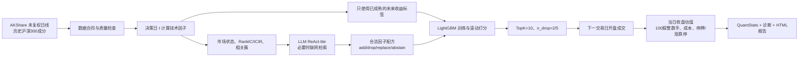

# mystock

`mystock` 是一个面向 A 股历史研究的、可审计的 AI 辅助量化研究系统。它把数据、因子、模型、组合、交易执行和报告拆成可替换模块，重点回答：

> 在明确的历史数据和交易约束下，一组因子是否能产生可复现的横截面选股结果？LLM 的因子选择是否带来可验证的增量？

它目前是研究工具，不是自动下单软件，也不构成投资建议。

## 当前实现到哪里了

当前主线是 S4/W1（2024–2025 短窗口，技术因子、经济意义覆盖约束、允许 LLM 联网检索辅助、`n_drop=5` 或 `n_drop=2`）。完整报告已提交到 GitHub `SheenaYI/mystock` 的 `main` 分支。

S4 的结果是探索性回测，不是严格 PIT 结论：

| 版本 | 2024–2025 累计收益 | CAGR | Sharpe | 最大回撤 | Beta |
| --- | ---: | ---: | ---: | ---: | ---: |
| S4/W1 `n_drop=5` | 119.91% | 31.61% | 1.63 | -17.41% | 1.16 |
| S4/W1 `n_drop=2` | 94.57% | 26.11% | 1.56 | -16.98% | 1.08 |

2024 年表现明显好于 2025 年，因此这些数字不能外推为未来收益。S4 使用联网文献检索，历史语境不是严格的决策日 PIT；旧 S0–S3 与 S4 的频率和合同也不同，不宜把它们当作公平的单变量对照。

## 它属于哪一种策略

当前策略更准确的描述是：

- **横截面股票选择**：在历史沪深 300 股票池内给每只股票打分并排序；
- **技术因子 + LightGBM**：用过去 OHLCV 计算技术因子，模型输出下一持有期的相对收益分数；
- **动态因子选择**：S4 由确定性市场状态、历史 RankIC/ICIR/组合边际证据和 LLM 研究意见共同决定候选因子的增删替换；
- **TopK + dropout 组合**：保持 10 只股票，调仓时最多替换 `n_drop` 只。

它不是独立的宏观择时策略，不做期货对冲或系统性空仓；也不是基本面、新闻或多资产组合优化系统。市场状态目前主要影响“选哪些技术因子”，而不是直接决定现金仓位，所以组合的市场 Beta 仍可能较高。

## 从数据到报告的实际流程



### 预测、训练和调仓

对每个决策日 `t`：

1. 用 `t` 收盘前已经可见的数据计算因子；
2. 标签是从下一交易日开盘到未来 `H` 个交易日开盘的收益，减去同一窗口的沪深 300 基准收益；
3. 只用已经过完这个未来窗口的成熟标签训练 LightGBM，避免把尚未发生的收益带入训练；
4. 模型给当期股票池输出分数；
5. 以 TopK=10 建仓，最多替换 `n_drop` 个旧持仓；
6. 在下一交易日开盘成交，收盘价只用于当天净值估值；
7. S4/W1 的 `H=5`、调仓频率 `R=5`、模型重估 `K=20`、LLM 因子决策频率 `J=20`。

## 因子

固定七因子基线为：`return_5`、`return_20`、`return_60`、`ma_gap_20`、`volatility_20`、`volume_ratio_20`、`intraday_range`。

扩展技术因子包括更长动量、反转、均线偏离、下行波动、回撤、量价相关、流动性、趋势效率、偏度、高低位等；技术 25 还加入相对沪深 300 的 `beta_60`、`market_corr_60`、个股特异收益和残差波动等。因子按动量/反转、趋势/均线、波动/回撤、成交量/流动性、相对市场五类组织，并计算相关性簇，避免只因为某个因子有微弱正 IC 就不断加因子。

目前仍以技术因子为主；基本面和新闻因子尚未形成同等严格、可复算的历史数据层。

## 回测方法和交易假设

### 回测引擎

- 组合：`TopKDropoutStrategy`，等权持有 10 只股票，调仓最多替换 `n_drop` 只；
- 执行：`LotLedgerEngine`，卖出优先、再买入，100 股整数手，不允许分数股和融资；
- 成交/估值：下一交易日开盘成交，当日收盘估值；
- 股票池：历史沪深 300 成分股档案，基准为沪深 300；
- 模型：滚动/扩展窗口 LightGBM，开发阶段选择 M1–M6 配置，决策日只用成熟标签；
- 报告：QuantStats 指标、相对基准诊断、年度表格、连续净值图和白话解释。

### 成本、滑点和可交易性

当前默认结构化成本（十进制费率）为：

| 项目 | 费率 | 说明 |
| --- | ---: | --- |
| 买入佣金 | 0.0003 | 0.03% |
| 过户费 | 0.00001 | 0.001% |
| 卖出印花税 | 0.0005 | 0.05%，仅卖出 |
| 双边滑点 | 0.0005 | 每次成交按 0.05% 估计 |

停牌、涨停无法买入、跌停无法卖出等证据会阻断订单；缺少可交易性证据时，诊断运行可使用 `block` 模式保守跳过，但不会假装成交。公司行动账本和复权证据已接入接口，不过现金分红的完整 PIT 仍是相对严格边界，不应解释为完全严格 PIT。

## 数据边界

- AKShare 未复权 OHLCV 是主行情源，原始文件保存在 `data/raw/`，标准化后进入本地仓库；
- `a-stock-data` 是补充源适配器：只保存原始补充数据、标准化字段并输出与 AKShare 的缺失/冲突报告，不覆盖原有行情；
- 聚宽数据用于补充历史停牌、涨跌停等可交易性证据，存入独立目录，不覆盖 OHLCV；
- 股票池使用历史沪深 300 成分档案，避免用整个回测期平均成交额倒推过去；
- 当前是“相对 PIT”：行情和成分股尽量按历史可见口径处理，但部分公司行动和 S4 联网文献存在缺口；
- 已发现的异常 `amount` 行会被隔离到质量目录，不静默填充。正式结果前必须查看质量报告。

## 如何安装和运行

建议使用 Python 3.12：

```bash
python3.12 -m venv .venv
.venv/bin/pip install -e .
cp .env.example .env
```

交互式配置凭据（只写入 `.env`，不会写入 git）：

```bash
.venv/bin/mystock config set-llm
.venv/bin/mystock config set-joinquant   # 需要停牌/涨跌停补充数据时使用
.venv/bin/mystock config status
```

数据命令：

```bash
.venv/bin/mystock data fetch --universe all
.venv/bin/mystock data update
.venv/bin/mystock data supplement --source a-stock-data \
  --symbols 600000.SH,000001.SZ --start-date 2025-01-01 --end-date 2025-12-31
.venv/bin/mystock data status
```

直接运行一个研究配置：

```bash
.venv/bin/mystock research run \
  --profile s4 --tradability-mode block \
  --llm-start 2024-01-01 --llm-end 2025-12-31

# n_drop=2 对照
.venv/bin/mystock research run \
  --profile s4_n2 --tradability-mode block \
  --llm-start 2024-01-01 --llm-end 2025-12-31
```

长任务建议使用可断点恢复的 worker：

```bash
.venv/bin/mystock research worker create \
  --profile s4 --llm-start 2024-01-01 --llm-end 2025-12-31
.venv/bin/mystock research worker run \
  --job-id <上一步返回的 job_id> --tradability-mode block
```

worker 清单、缓存和状态在 `data/warehouse/jobs/`。重复运行同一任务会复用已完成的证据/矩阵缓存；中断后再次运行可以从最近成功的决策点继续。

## 报告在哪里、怎么看

完整可读报告位于：

- `data/warehouse/reports/S4_W1_n5/report_technical_s4_w1_economic_coverage_n5.html`
- `data/warehouse/reports/S4_W1_n2/report_technical_s4_w1_economic_coverage_n2.html`

报告包含年度指标对比、连续净值曲线、相对沪深 300 的超额表现、Beta/回撤/换手等诊断、数据质量状态和 LLM 的白话解释。`continuous_*.html` 是 QuantStats 的详细连续报告；若要先看结论，优先打开上面的完整报告。

重点指标含义：

- **收益/CAGR**：策略净值增长速度；
- **Sharpe**：单位波动承担的收益；
- **最大回撤**：从高点回落到低点的最坏幅度；
- **Beta**：策略随沪深 300 同涨同跌的程度；接近 1 表示更像大盘暴露；
- **超额收益/信息比率**：相对基准的主动收益及其稳定性。

## 面向谁，以及现在能不能用来投资

规划用户是希望理解“数据—因子—模型—交易”链路的普通投资者和研究者；但当前实际适用对象仍是能阅读 HTML 报告、理解回测假设并检查数据质量的研究人员/开发者。

当前版本不能保证未来盈利，也不能自动告诉用户“明天买哪只股票”。它给出的是在固定历史合同和交易摩擦下的研究结果，适合用于：

1. 比较因子配方和组合规则；
2. 发现数据、前视偏差和可交易性问题；
3. 生成可复核的研究报告。

## 预计运行时间

在当前机器和网络条件下，S4 冷启动完整跑一组 2024–2025 约需 40–50 分钟；联网文献检索、LightGBM 训练和数据规模会影响时间。复用 evidence/matrix/LLM 缓存后，重复运行会明显缩短。首次运行建议使用 worker，并观察 `data/warehouse/jobs/` 状态文件。

## 当前限制和下一步

- S4 的联网文献证据没有按每个决策日做严格 PIT 封存；
- 基本面、新闻事件因子尚未完成统一的可复算历史数据合同；
- 停牌/涨跌停补充数据仍可能有缺口；
- 交易执行是历史回测账本，不是模拟盘或实盘接口；
- 还需要继续验证组合构造、调仓频率、Beta 暴露和更广因子篮的稳定性。

因此，项目的下一阶段应优先提高数据覆盖和组合风险控制，再讨论接入模拟盘，而不是把当前回测直接当成投资产品。

## 目录速览

```text
src/data/                         数据源、标准化和本地存储
src/research/contracts/           冻结实验合同与哈希
src/research/factors/             固定与扩展技术因子
src/research/models/              标签、滚动 LightGBM/Qlib 模型
src/research/portfolio/           TopK/dropout、成本、基准时钟
src/research/backtest/            开盘执行、收盘估值、公司行动账本
src/research/llm/                 状态证据、ReAct-lite、联网语境
src/research/jobs/                可断点恢复的本地 worker
src/research/report_builder.py    HTML 报告与白话解释
scripts/                          数据校验、运行和审计脚本
data/raw/                         原始数据（不覆盖）
data/warehouse/                   标准化数据、缓存、诊断和报告
docs/                             设计、边界和工作日志
```

## 许可证和研究声明

本仓库用于个人研究和工程验证。任何历史回测结果都受数据质量、成本假设、样本区间和模型选择影响，不代表未来收益或构成证券投资建议。
